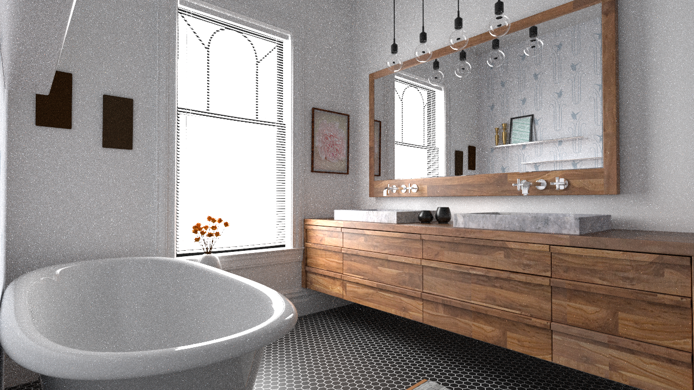
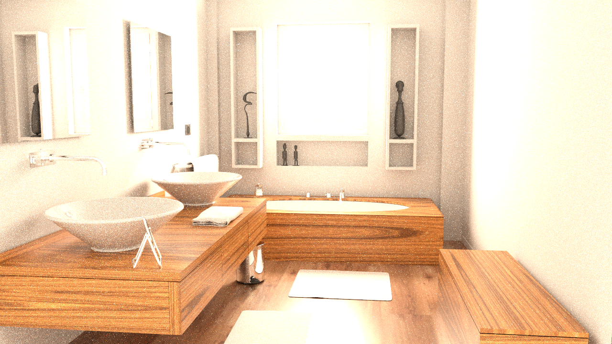
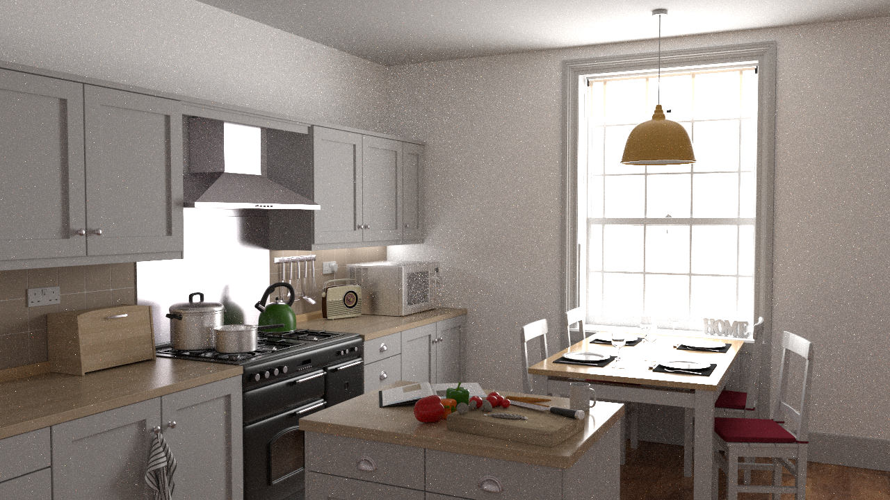
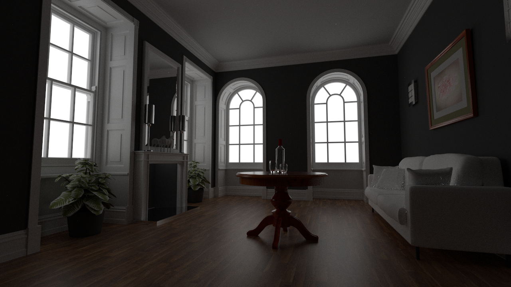
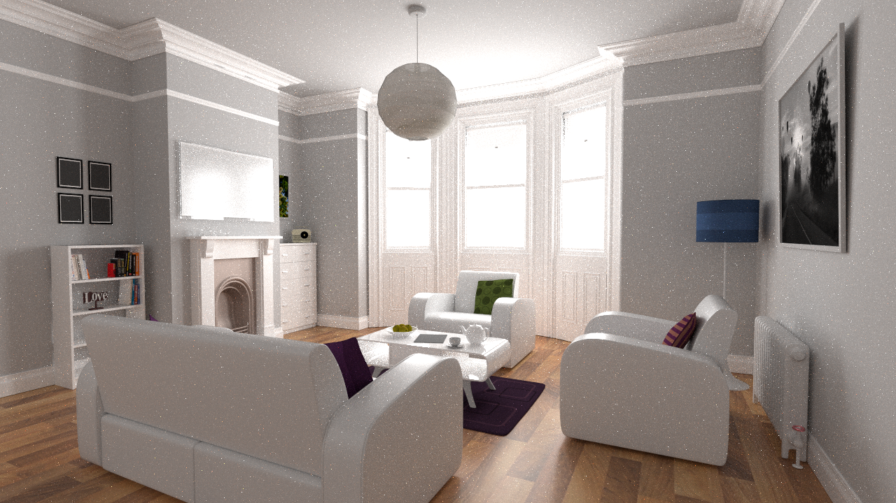
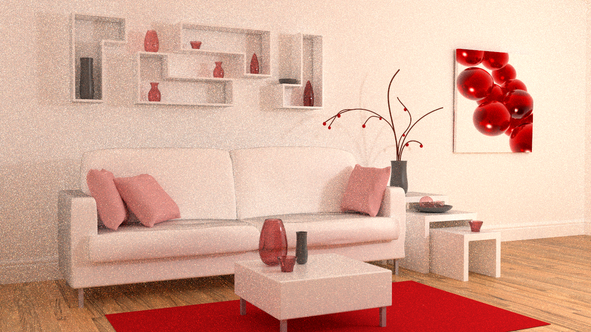
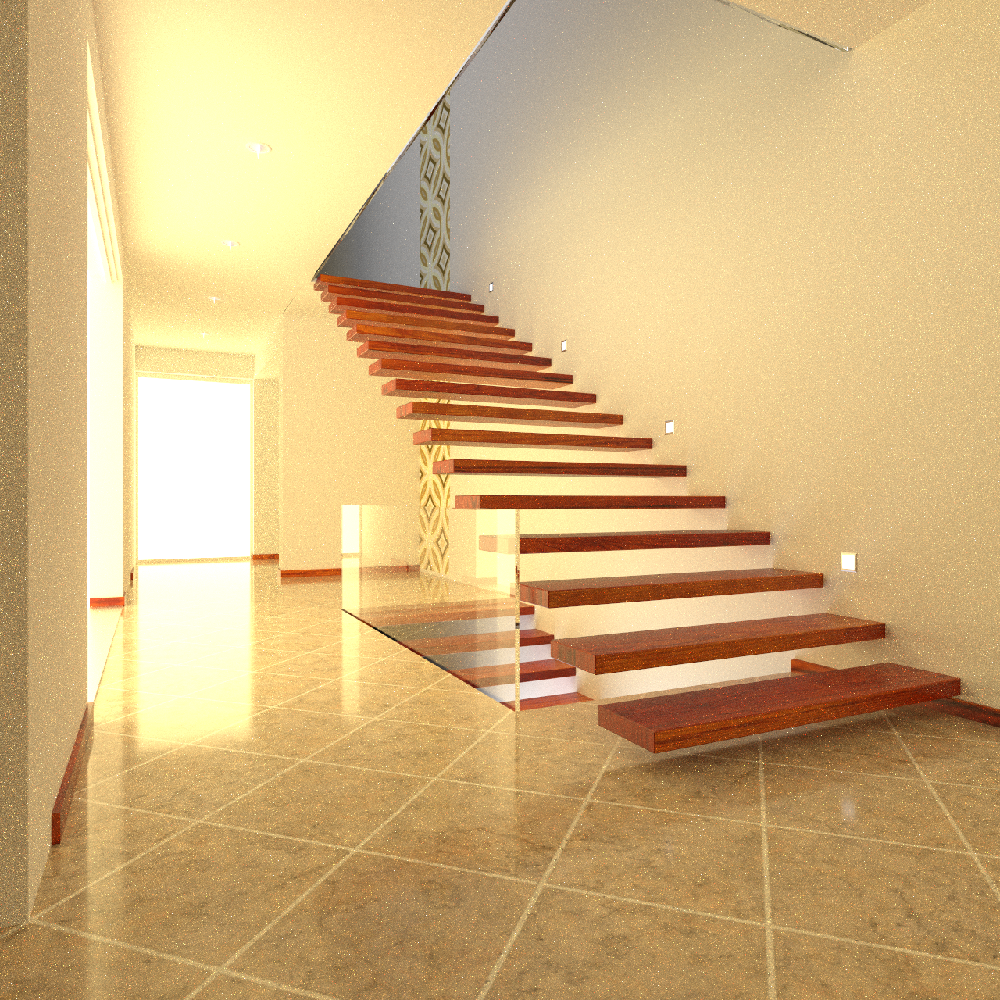
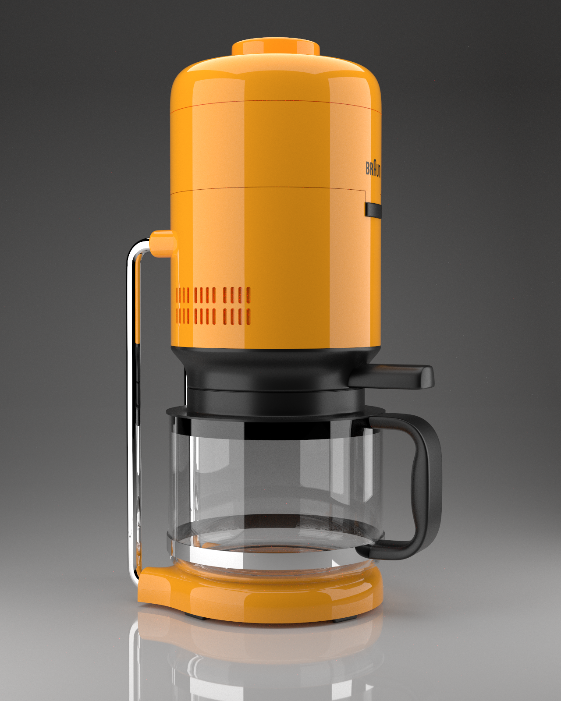
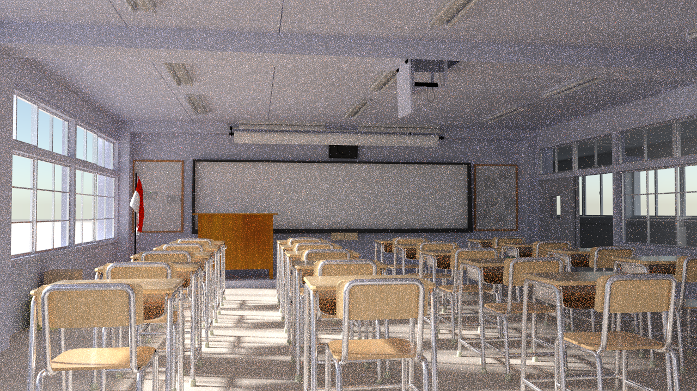

# **Quecto-JL**

# Introduction

Quecto-JL is a minimal but capable volumetric and physically-based
path tracer written in Julia from scratch. It aims at rendering
realistic and complex scenes while being lightweight and user-friendly,
without sacrificing performance and being comparable in speed with
reasonably optimized C++ implementations, despite being written in a
high-level language. It is inspired by Yocto/GL
[^1], of which it shares the philosophy, the
simplicity, the mathematical background, many data structures and the
majority of design choices.

# Library Design

The library is organized as a standard Julia package. Its dependencies
are listed in the *Project.toml*. The main entry point is the function:

```julia 
trace(scenePath::String, shader::String, resolution::Integer,
      samples::Integer, filename::String, multithreaded::Bool, quiet::Bool,
      maxBounces::Integer, camera::Integer, displaySampleTime::Bool)
```

which takes the path to a scene and outputs the rendered image,
according to the given parameters, in the directory *out/*.

Here follows a brief description of the modules in which the package is
subdivided.

-   **Quecto**: main loops of computations.

-   **Pathtrace**: homogenous volumetric path tracing and its more basic
    form (without volumes support and with only basic materials).

-   **Raytrace**: naive recursive raytracing algorithm.

-   **Bvh**: two-level bounding volume hierarchy to accelerate queries
    on triangle and quad meshes, line sets and scene instances.

-   **Intersect**: fast implementations for ray-scene intersections.

-   **World**: all the data structures that compose a scene: camera
    model, instances, shapes, materials and environments.

-   **Types**: basic mathematical and geometrical structures that make
    meshes.

-   **Loader**: scene parsing and loading.

-   **Algebra**: mathematical operations, geometrical transformations
    and color conversion.

-   **Bsdf**: sampling and evaluation of bsdf for all types of
    materials.

-   **Pdfs**: sampling and evaluation of pdf for all types of materials.

-   **Eval**: lookup and evaluation of scene properties.

-   **Lights**: everything needed to perform light sampling.

-   **MaterialFunctions**: all the math needed to simulate a physically
    based material.

-   **Baseshaders**: basic shaders implementation (eyelight, color,
    normal).

# Implementation

## Algorithms

The most capable algorithm implemented is the shader called
*volumetric*, which includes the full set of features implemented in the
library. In particular, some features of interest are:

-   rendering of constant-density **volumes**;

-   **russian roulette** for early-stopping of ray bounces;

-   **light sampling** for better convergence in scarcely lighted
    environments;

-   **BSDF** and **PDF functions** for the following materials: matte,
    glossy, reflective, transparent, refractive, volumetric and
    subsurface.

A few other shaders were implemented along the way, such as *eyelight*,
*color*, and *normal* which can be helpful for debugging and quick
previewing and have contributed a lot to the speedup of the construction
of the full render. Moreover, two simpler rendering algorithms were
implemented: *raytracing* and *pathtracing*.

## Design notes and optimization

Here follows a brief listing of some interesting choices regarding code
style, design, performance, and the main differences in optimization
between our library, and the reference, Yocto/GL plus the obviously
different choices that must be made to adopt the style, techniques and
advantages of the powerful Julia programming language in which Quecto is
written.

### Code style and typing

Always keeping performance in mind, we followed a simple but rigorous
code style throughout the package. The style of Julia we used gives up
some of the more high-level features - in particular, the vast use of
abstract types and inheritance - in favor of a much stricter and C-like
approach to type declaration, only using exact concrete types. For
example, most of the math-related methods we wrote accept only `Float32`
or `Int32` parameters (instead of the typical `Float` or `Integer`
abstract types). This was due to a very practical reason: the exact data
type used for different structures matters so much to the performance
that we would much prefer the program crashing rather than having
`Float64`s hanging in memory undetected.

All of our basic data types are static, immutable, and stack-allocated.
3D points, for example, are static vectors from the *StaticArrays*
library[^2], and all structures are immutable. The use of
heap-allocated, dynamic collections is very much pondered and restricted
to few situations, such as storing the scene data. Usually, whenever we
used heap-allocated structures, we spent some computations to calculate
their sizes and inform the compiler adequately to have only the correct
allocation of maximal size.

### Optimization of BVH stack

The algorithm to intersect a ray with the BVH uses a stack structure,
implemented as an array of node indices (hard-coded in Yocto/GL to a
size of 128): allocating this memory for every iteration (at least in
Julia) is extremely wasteful.

A first solution would be to allocate one such array for each thread at
the beginning of execution, reusing them throughout the rendering.

However, we found that knowing the global size of these stacks at
*compile time* proves to be extremely beneficial, so we decided to
instantiate only one stack, at the beginning of execution, with enough
room to accommodate up to 128 threads, each only using a slice of it.

This brings a massive speedup (in the order of 2x) to the render time,
with the drawback that machines with more than 128 threads would need to
recompile the package changing this global variable. We are not
concerned about the waste of memory for machines with less than 128
threads since the whole stack amounts to barely a few Kilobytes.

### Intersection

For *bounding box intersection*, we adopted at first the most intuitive
implementation, described in [^3] and [^4], that
exploits SIMD instruction advantage, as we can see from the following
lines of code:

```julia 
function intersectBbox(ray::Ray, rayDInv::SVec3f, bbox::Bbox3f)::Bool 
    # Absolute distances to lower and upper boxcoordinates 
    itMin::SVec3f = (bbox.min - ray.origin) * rayDInv
    itMax::SVec3f = (bbox.max - ray.origin) * rayDInv 
    # The four t-intervals (for x-/y-/z-slabs, and ray p(t)) 
    maxTmin::SVec4f = SVec4f(fastMin.(itMin, itMax)\..., ray.tmin) 
    minTmax::SVec4f = SVec4f(fastMax.(itMin, itMax)\..., ray.tmax) 
    # Easy to remember: \"max of mins, and min of maxes\" 
    t0::Float32 = fastMaximumComponent(maxTmin)
    t1::Float32 = fastMinimumComponent(minTmax) 
    return t0 <= t1
```

After some benchmarking and testing, we verified that avoiding the use
of vectors and unrolling the comparison, as shown in
[^5], brings minor improvements in performance,
reducing the number of computations needed in the optimal case and
removing the overhead of the 4-element vectors' construction and
synchronization. Since this function is the major bottleneck of the
rendering pipeline (roughly 60% of the time is spent here), we preferred
a less readable but slightly faster approach.

### Julia specific macros

We thought it could be worth mentioning a couple of Julia-specific
macros that were very useful for optimization purposes.

1.  **\@view** makes sure that when accessing slices of vectors no data
    is ever copied, and everything points to the original memory
    locations.

2.  **\@inbounds** disables bounds checking. It can be used whenever
    bounds are already implicitly safe, to improve significantly the
    performance of loops and vector indexing operations.

3.  **\@turbo** informs the compiler that an operation can be vectorized
    by exploiting SIMD instruction and a loop unrolled by the factor
    specified.

4.  **\@inline** hints to the compiler that the following function
    should be always inlined.

5.  **\@threads** enable multithreading execution of the loop in which
    it was used.

# Results and benchmarks

In this section, we present a gallery of the achieved qualitative
rendering results for various types of scenes from various sources
[^6] using our Julia library Quecto-JL.

<figure>

<figcaption>Bathroom scene rendered at a resolution of 1280x720 with
8192 samples per pixel</figcaption>
</figure>

<figure>

<figcaption>Bathroom scene rendered at a resolution of 1280x720 with
8192 samples per pixel</figcaption>
</figure>

<figure>

<figcaption>Kitchen scene rendered at a resolution of 1280x720 with 8192
samples per pixel</figcaption>
</figure>

<figure>

<figcaption>Livingroom scene rendered at a resolution of 1280x720 with
4096 samples per pixel</figcaption>
</figure>

<figure>

<figcaption>Livingroom scene rendered at a resolution of 1280x720 with
8192 samples per pixel</figcaption>
</figure>

<figure>

<figcaption>Livingroom scene rendered at a resolution of 1280x720 with
8192 samples per pixel</figcaption>
</figure>

<figure>

<figcaption>Staircase scene rendered at a resolution of 1280x2276 with
4096 samples per pixel</figcaption>
</figure>

<figure>

<figcaption>Staircase scene rendered at a resolution of 1280x1280 with
4096 samples per pixel</figcaption>
</figure>

<figure>

<figcaption>Coffee machine rendered at a resolution of 1280x1600 with
4096 samples per pixel</figcaption>
</figure>

<figure>

<figcaption>Classroom scene rendered at a resolution of 1280x720 with
8192 samples per pixel</figcaption>
</figure>

## Benchmarks and comparison with C++

We observe from the benchmarks below that our renderer consistently
performs in the range between 2x and 3x slower than the reference,
Yocto/GL, implemented in C++. We are very satisfied with these results,
and we believe to have pushed the performance close to the limit of what
Julia can offer.

-------------------------

**Scene**| **Resolution**| **Yocto/GL**| **Quecto-JL**|
|:----------------:|:------------:|:----------:|:-----------:|
|Coffee machine |  1280x1024   |  3.08s   |   7.00s |
|Features 1     |   1280x533   |  1.60s   |   2.50s |
|Staircase 1    |   720x1280   |  3.59s   |   7.59s |
|Livingroom 1   |   1280x720   |  3.52s   |   8.47s |

Average execution time for a single sample, single-threaded

-------------------------

**Scene**| **Resolution**| **Yocto/GL**| **Quecto-JL**|
|:----------------:|:------------:|:----------:|:-----------:|
|Coffee machine |  1280x1024   |  0.25s   |    0.62s |
|Features 1     |   1280x533   |  0.12s   |    0.21s |
|Staircase 1    |   720x1280   |  0.28s   |    0.65s |
|Livingroom 1   |   1280x720   |  0.26s   |    0.69s |

Average execution time for a single sample, with 20 parallel threads

-------------------------

All the benchmarks were performed on an Intel i9-10900k @ 5.3GHz CPU.

# Conclusions and future works

With Quecto-JL we have shown that is possible to build a simple Julia
CPU pathtracer that runs in comparable time of a C++ implementation,
achieving a slowdown of just about 3 times, which on the other hand
enables all of the possibilities that come with a high-level language.

A future improvement of this library could be a GPU implementation of
the rendering pipeline, possibly thanks to the native support for
writing CUDA kernels in Julia.

Also, due to the lack of a Julia library to load HDR textures in the
same way that Yocto/GL does, our renders of HDR textures differ
slightly. A reimplementation of HDR parsing and loading would uniform
our results to the style of Yocto/GL, especially in cases of scenes with
very limited light.

Another area from which very interesting research could arise is the
expansion of our pathtracing algorithm to work in a `bidirectional` way.
We would expect however to verify a common belief in the rendering
industry, that this type of improvement is only helpful in specific
cases and does not lead to any noticeable improvements in general.

Lastly, a fundamental addition that would be needed to use this renderer
in real-world scenarios would be the addition of a denoising algorithm,
which has proven during the last years to be crucial in the rendering of
complexly lit scenes.

# Acknowledgements

This work was made possible by the wonderful course in Fundamentals of
Computer Graphics held at Sapienza University of Rome by Professor Fabio
Pellacini, whose passion and love for the subject are shown in each and
every lecture and act as a great source of inspiration.


## **Authors:**
Antonio Andrea Gargiulo \
Giorgio Strano 

[^1]: <https://doi.org/10.2312/stag.20191373>
[^2]: <https://github.com/JuliaArrays/StaticArrays.jl>
[^3]: <https://doi.org/10.1007/978-1-4842-7185-8_2>
[^4]: <https://doi.org/10.1007/978-1-4842-7185-8_32>
[^5]: <https://doi.org/10.1145/1198555.1198748>
[^6]: <https://casual-effects.com/data>
